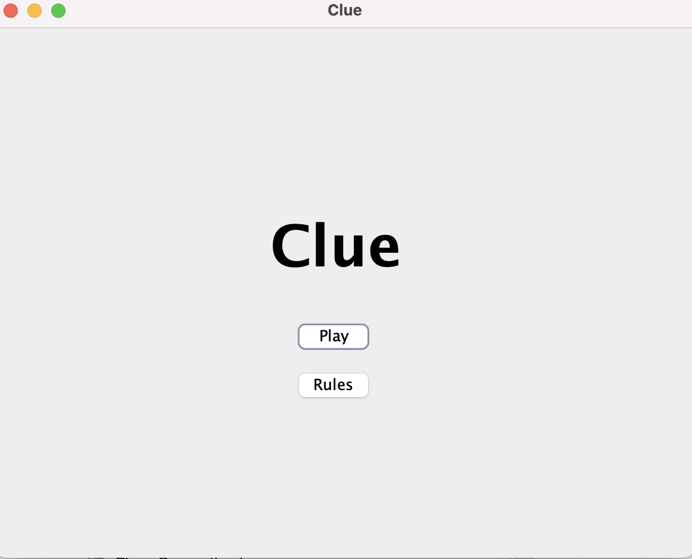
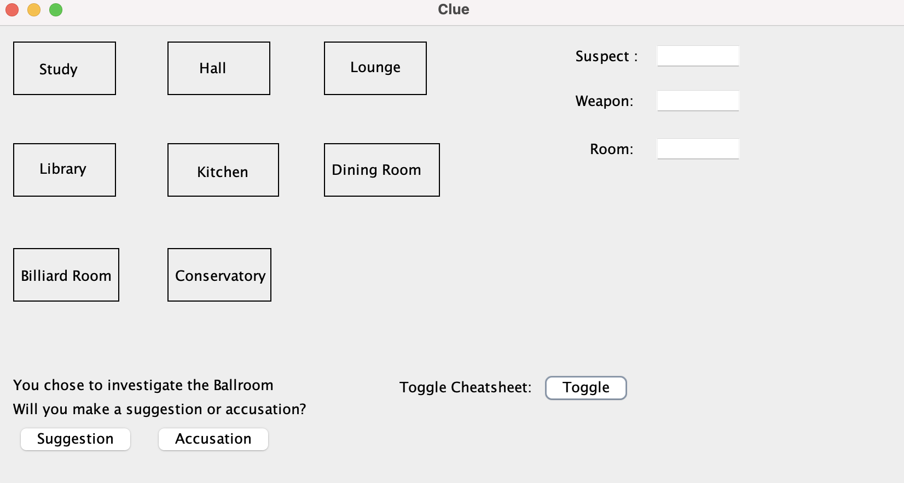
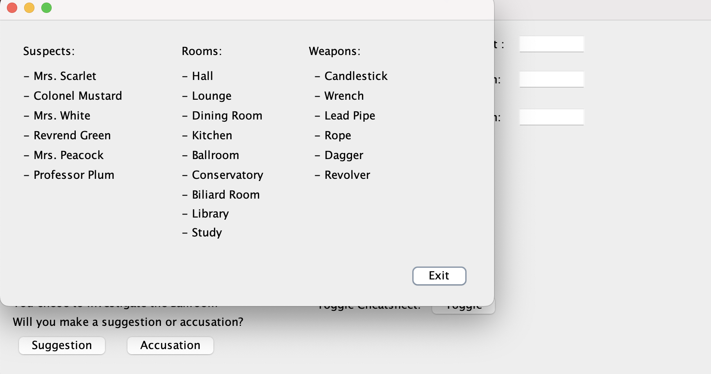

[Back to Portfolio](./)

Clue Game
===============

-   **Class:CSCI-325 Objected Oriented Programming** 
-   **Grade:A** 
-   **Language(s):Java** 
-   **Source Code Repository:** [features/mastering-markdown]([https://guides.github.com/features/mastering-markdown/](https://github.com/csu-cs/CSCI-325_Clue_Game))  
    (Please [email me](mailto:JABraddock@csustudent.net?subject=GitHub%20Access) to request access.)

## Project description

Me and my group at the time built a functional clue game that automates the clue process and lets you play the game through a Java application including guesses, eliminating rooms, and randomizing the scenarios each and every time.

## How to  run the program

Just press the run button.

## UI Design

The User can start the game or either view the rules of how to play. Upon entering the game, the user can enter a room to make a suggestion or accusation, with the suggestion being a guess upon what the crime scenario was, or accusation to try and win or lose the game. They can also toggle the cheatsheet to see what is still in play and what is not in play.

  
Fig 1. The launch screen

  
Fig 2. The Game Board

  
Fig 3. The Cheat Sheet

For more details see [GitHub Flavored Markdown](https://guides.github.com/features/mastering-markdown/).

[Back to Portfolio](./)
