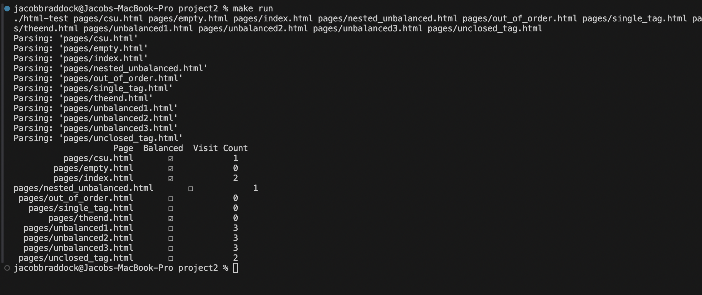

[Back to Portfolio](./)

Basic HTML Parser and Cralwer
===============

-   **Class:CSCI-315 Data Structures** 
-   **Grade:A** 
-   **Language(s):C++, HTML** 
-   **Source Code Repository:** [features/mastering-markdown](https://github.com/PJB02/CSCI-315-2024-Fall-Personal/tree/master/project2)  
    (Please [email me](mailto:JABraddock@csustudent.net?subject=GitHub%20Access) to request access.)

## Project description

This is an HTML parser to determine if the HTML tags are properly balanced and then acts as a web crawler to go and find all unique possible links that are visitable.

## How to compile and run the program

In the project2 directory, run make, then make run

## UI Design
The program starts at csu.html, crawling and parsing its way through the rest of the files before giving the results back of its findings.

  
Fig 1. The results

For more details see [GitHub Flavored Markdown](https://guides.github.com/features/mastering-markdown/).

[Back to Portfolio](./)
