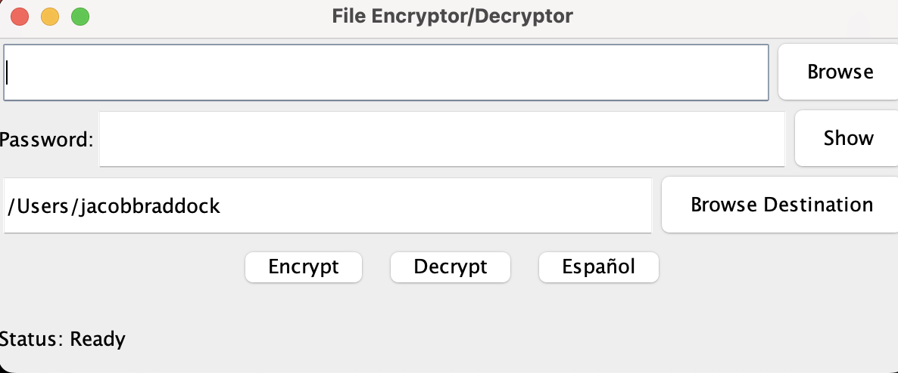
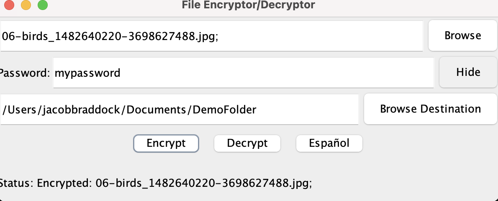
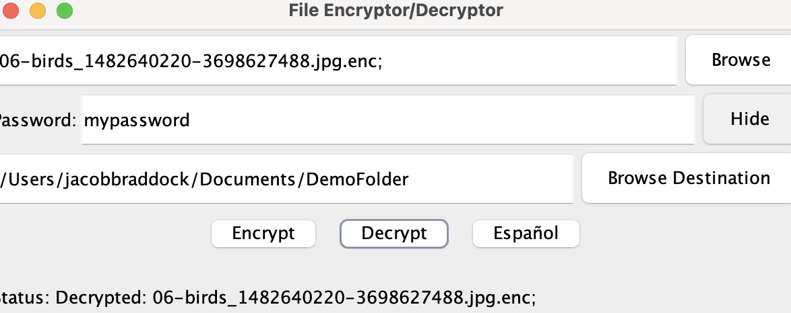

[Back to Portfolio](./)

Senior Project
===============

-   **Class:CSCI-499 Senior Project Implementation and Defense** 
-   **Grade:A** 
-   **Language(s):Java** 
-   **Source Code Repository:** [features/mastering-markdown](https://github.com/PJB02/CSU-Senior-Project)  
    (Please [email me](mailto:JABraddock@csustudent.net?subject=GitHub%20Access) to request access.)

## Project description

The following project is a file encryption/decryption application that works on most small files by first allowing the user to select the files and destination and taking a password. This password is this turned into the cryptographic key for the AES encryption process, which can later then be Decrypted.

## How to run the program
Simply click the .jar file if you have java and its updated

## UI Design

  
Fig 1. The Base Screen

  
Fig 2. File Encrypted

  
Fig 3. File Decrypted

For more details see [GitHub Flavored Markdown](https://guides.github.com/features/mastering-markdown/).

[Back to Portfolio](./)
